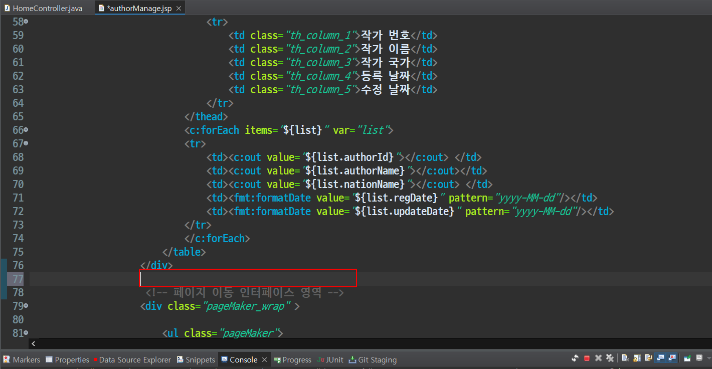

## 기능구현
- 회원가입(주소API연동, 이메일 인증, ajax를 사용하여 아이디 중복검사)
- 관리자 페이지(인터셉터 적용, 상품관리, 회원관리)
- 업로드(이미지 등록, 수정, 삭제)
- 검색
- 페이징
- 구매(장바구니, 포인트사용)
- 댓글(등록,수정,삭제)
- 중간에 막혔거나 에러 해결 못하겠으면 ybnr92@gmail.com 으로 문의

 

## 목표
- 검색 인터페이스 구현 & 검색 결과 없을 시 뷰 처리

 

## 순서
- 검색 인터페이스 추가(`authorManage.jsp`)
- 검색 결과 없을 경우 처리

 

## 검색 인터페이스 추가(authorManage.jsp)
- 기존 `<form>` 태그가 있지만 검색 기능에 사용 될 `<form>` 태그를 새로 추가하여 구현한다.
- 물론 js코드를 통해서 기존 `<form>` 태그를 활용하여 검색 기능을 구현해도 상관은 없다.
- 하지만 보통 사용자가 `<input>`태그에 검색어를 입력 후 enter를 누르면 검색이 되는데 javascript를 통해 기존 `<form>` 태그 활용하는 방식은 enter를 눌렀을 때 동작하지 않는 단점이 있다.
- 사용자가 입력할 `<input>`태그와 검색을 실행하는 `<button>`태그를 새로운 `<form>`태그 안에 작성하고자 한다.

 

